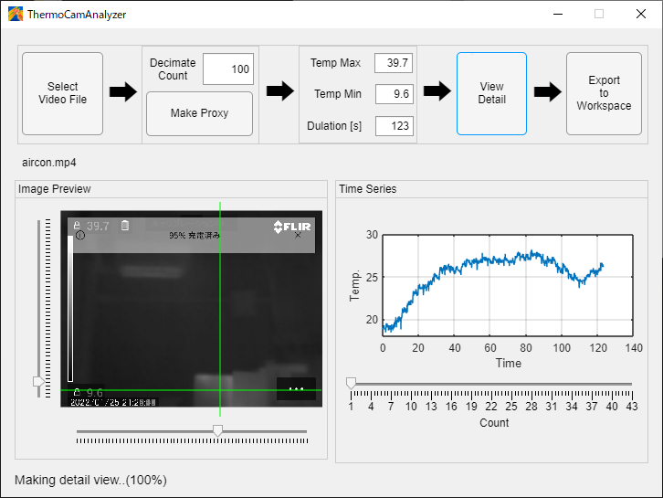

## ThermoCamAnalyzer

### ScreenShot




## これはなに

サーモグラフィカメラで撮った動画ファイルから、特定の箇所の温度の時系列を吐き出すMATLABアプリです。

時系列データを見ながら、測定点を調整することができます。

## 使い方

### 用意するもの

- サーモグラフィカメラで撮った動画ファイル
    - カラーマップはグレースケール(ホワイトホット)を指定
    - 温度スケールは「手動」にして固定しておく
    - 画像モードは「赤外線」（熱画像のみ）にしておく
- 撮影時間の情報（動画ファイルの時間と実際の時間が合わないことがあるので）

### インストール手順

1. https://github.com/akito914/ThermoCamAnalyzer/releases/latest
から、```ThermoCamAnalyzer.mlappinstall```をダウンロード
1. MATLABで開くと「[マイアプリ]にインストールしますか？」と出るので「インストール」を選択
1. 「アプリ」タブに追加されていればOK


### 使い方

1. アプリ「ThermoCamAnalyzer」を実行
1. 「Select Video File」をクリックして動画ファイルを読み込む
1. 「Decimate Count」でプレビュー表示に使う間引き数を設定します。長時間データの動画ファイルを全部読み込むと重いので、間引きしたデータで時系列のプレビューを行います。デフォルトの間引き数は「100」で、フレーム数を1/100に間引きして表示します。設定したら「Make Proxy」で間引きしたデータを作ります。
1. 温度スケールの最大値と最小値、撮影時間の情報を設定します。
    表示された２本のグラフはそれぞれ間引きした区間の最大値と最小値です。
1. 計測点を設定します。画像のプレビューは右下のスライドバーで間引き後のフレーム数を指定できます。
1. 「View Detail」をクリックすると、動画ファイルの全フレームを使って詳細な時系列を表示します。
1. 「Export to workspace」をクリックすると、この時系列データをMATLABワークスペースに書き出します。
    吐き出された構造体の中身は次の通りです。
    - time: 時刻のベクトル
    - temp: 温度情報のベクトル
    - location: 測定点の座標ベクトル

